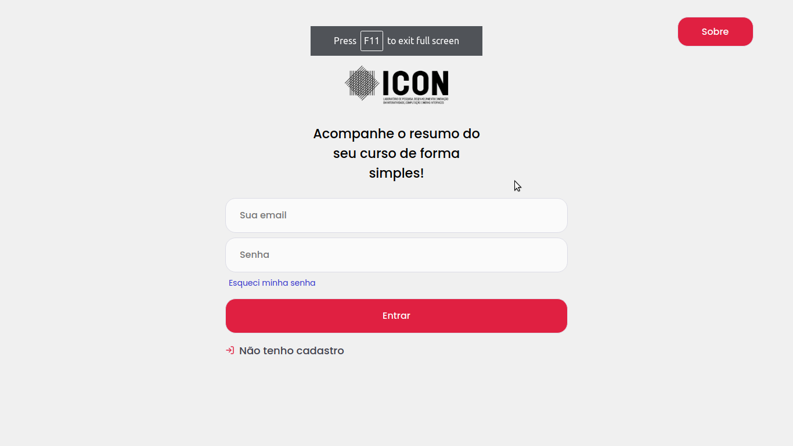
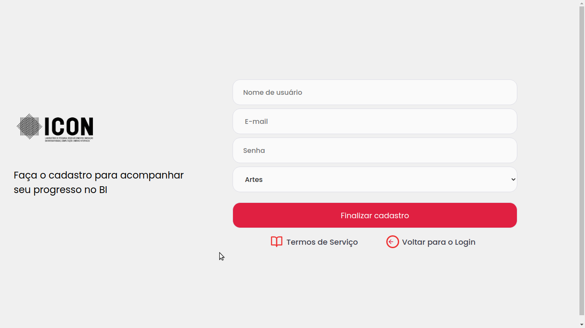
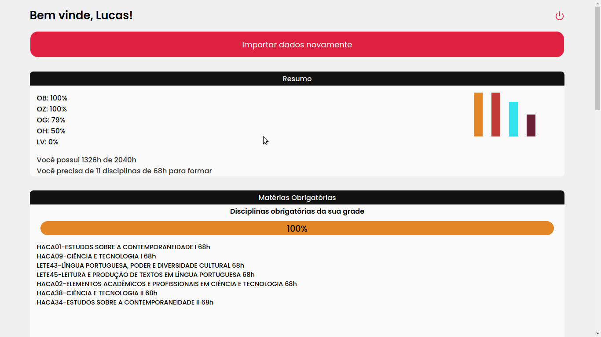
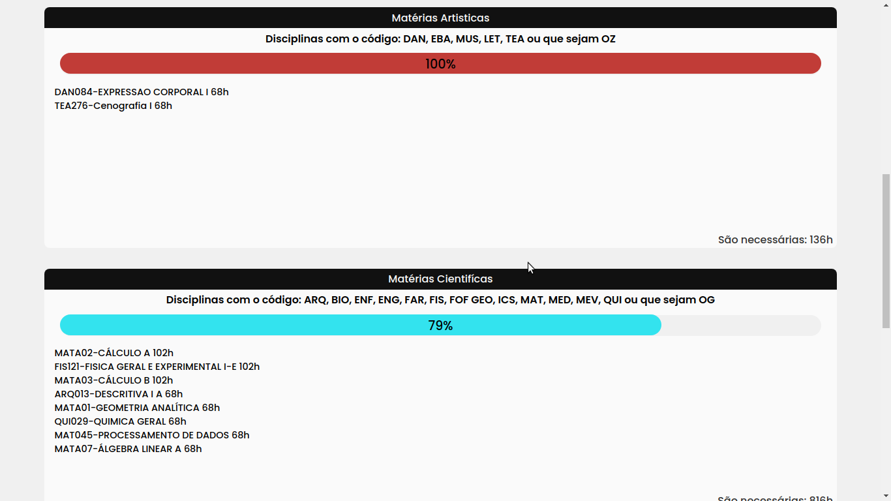

## Iconselho

### Iconselho é uma aplicação criada para solucionar demandas de estudantes e professores do Instituto de Humanidades, Artes e Ciências Prof. Milton Santos. Ele permite que estudantes possam acompanhar seu progresso nos Bacharelados Interdisciplinares e ter acesso as necessidades que ainda precisam cumprir para a sua formação.

#### Backend em repo privado.

### Built with:
- Axios
- ReactJs
- React-router-dom
- React-minimal-pie-chart
- Styled-components
- A lot of coffee :)

### Instructions
- Open your terminal.
- Insert `git clone https://github.com/LucasAdorno/iconselho-frontend.git`
- Insert `cd iconselho-frontend`
- if you don't have nodeJS on your device, install https://nodejs.org/en/download/
- Insert the `npm i` to install all dependencies.
- Insert `npm run start` to run.

### Preview

  
  
  
  
  

